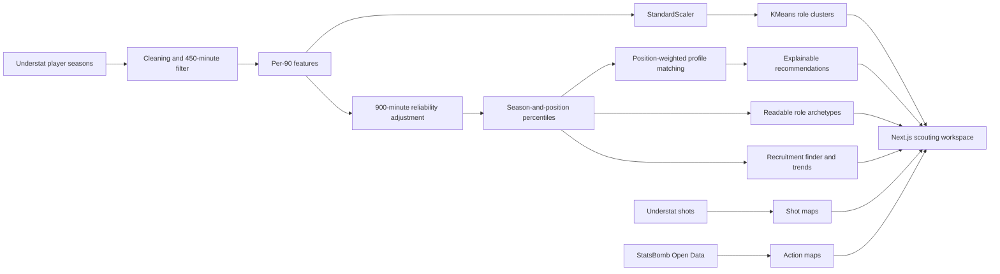

# Football Player Scouting Tool

[](https://nextjs.org/)
[](https://react.dev/)
[](https://www.python.org/)
[](#data-coverage-and-limitations)

An interactive Premier League recruitment workspace for discovering comparable players, understanding playing profiles, and exploring where players shoot and operate on the pitch.

The project combines a Python data and machine-learning pipeline with a responsive Next.js dashboard. It is built entirely from free data and keeps source limitations visible instead of presenting estimates as recorded events.

## What you can do

- Find the closest stylistic matches for a selected player and season.
- Search a season-and-position recruitment pool by club, playing style, priority metric, percentile, and minutes.
- Compare percentile profiles with an overlaid radar chart.
- Follow a player's multi-season trajectory with reliability-adjusted percentile trends.
- See licence-verified player portraits where reusable photography is available, with initials as a safe fallback.
- Scan player strengths across an entire comparison group with a metric heatmap.
- Explore real Understat shot-density maps and individual shot locations.
- Inspect recorded on-ball activity from StatsBomb Open Data.
- Compare players on any two available performance measures.
- Save up to 12 players to a browser-based shortlist.
- Filter the workspace by position, season, target player, and result count.

## Current coverage

| Dataset | Coverage in this repository | Used for |
| --- | --- | --- |
| Understat | 1,854 EPL player-season profiles across 2021/22–2025/26, filtered to 450+ minutes | Similarity, percentiles, radar charts, role labels, and season profiles |
| Understat shots | 48,492 attempts across 819 cached player files | Shot density, shot locations, goals, xG, and shot selection |
| StatsBomb Open Data | 380 EPL matches and 548 players from 2015/16 | Recorded-action heatmaps and action-type summaries |
| Wikimedia Commons | 455 licence-verified portraits across 819 unique player identities | Player cards, comparisons, and profile photography |

Goalkeepers are excluded from the current similarity model. The primary feature set is attacking and creative because that is what the free Understat source supports consistently.

### Optional API-Football enrichment

The repository includes a quota-safe API-Football pipeline for evaluating defensive and availability data before adding it to the model. It caches every page, preserves missing values, writes a coverage report, stops at 80 requests per UTC day, and stays below nine calls per rolling minute by default.

```bash
export API_FOOTBALL_KEY="your_key"
python3 scripts/build_api_football_enrichment.py --seasons 2024
```

Alternatively, copy `.env.example` to `.env` and place the key there; `.env` is ignored by Git.

For a one-page coverage test that uses at most one request:

```bash
python3 scripts/build_api_football_enrichment.py --seasons 2024 --strategy league --max-pages 1
```

Raw and normalized API-Football data stay out of Git. The key is read only from the environment and is never written to generated files. Defensive fields are not activated in similarity until the quality report shows at least 80% coverage for the relevant season and position.

The free plan currently exposes seasons 2022 through 2024 and limits every player query to three pages. The default team-based strategy collects up to three pages per EPL club and records any omitted pages in the quality report. A partial collection is never eligible for automatic model activation.

The provider's season-level `passes.accuracy` field is retained under the neutral name `passes_accuracy_value` and excluded from similarity until its exact semantics are confirmed.

The verified 2024/25 pull produced 1,132 normalized team-player rows and 388 rows above the 450-minute threshold. Defensive coverage was strong among eligible rows, but seven club pages were inaccessible on the free plan. For that reason, the data remains a local enrichment candidate rather than a production model input.

## How the analysis works



The production export uses eight per-90 features: goals, xG, assists, xA, shots, key passes, xGChain, and xGBuildup. Features are standardized before a five-cluster KMeans model is fitted. In the product, every rate is partially pooled toward its season-and-position average with a 900-minute prior before percentile ranking. This empirical-Bayes-style adjustment reduces small-sample extremes without changing the raw numbers shown to the user. Players are then compared with position-specific feature weights. This keeps a forward match focused on finishing, a winger match balanced between threat and creation, and a midfielder or defender match more sensitive to involvement and buildup. Each recommendation exposes finishing, creation and involvement fit plus a minutes-based evidence-strength label. The recruitment finder and trend chart use the same adjusted percentiles, while human-readable archetypes remain percentile-based heuristics.

The browser consumes precomputed JSON, so exploring players does not require a live Python server or external API calls.

Player identity and presentation are kept separate: provider IDs remain the stable identity, raw source names stay in the normalized datasets, and a small reviewed override table supplies recognisable football display names and correct diacritics in the product. HTML entities in provider names are decoded automatically. Add future corrections to `src/display_names.py` rather than editing generated JSON.

## Run locally

### Web application

```bash
cd frontend
pnpm install
pnpm dev
```

Open [http://localhost:3000](http://localhost:3000).

Create a production build with:

```bash
cd frontend
pnpm build
pnpm start
```

### Python prototype

The original Streamlit interface remains available as a reference implementation:

```bash
python3 -m venv .venv
source .venv/bin/activate
pip install -r requirements.txt
streamlit run app.py
```

Open [http://localhost:8501](http://localhost:8501).

## Refresh the data

The generated frontend assets are committed, so refreshing data is optional for normal local use.

```bash
python3 scripts/build_free_data.py
python3 scripts/export_free_frontend_data.py
python3 scripts/build_understat_shot_data.py
python3 scripts/build_statsbomb_event_lab.py
python3 scripts/build_commons_player_images.py
```

You can also run the frontend shortcuts:

```bash
cd frontend
pnpm export-data
pnpm refresh-api-football
pnpm refresh-shot-data
pnpm refresh-event-lab
pnpm refresh-player-images
```

Understat is accessed through an unofficial community endpoint, so the repository keeps a local cache and the refresh scripts should be run sparingly. StatsBomb event data comes from its official [open-data repository](https://github.com/statsbomb/open-data).

## Project structure

```text
football-player-scouting-tool/
├── frontend/                       # Next.js application
│   ├── app/                        # Dashboard UI and styling
│   └── public/
│       ├── scouting-data.json      # Precomputed profiles and model output
│       ├── shot-data/              # Lazy-loaded Understat shot files
│       ├── player-images/           # Licence-verified portraits and manifest
│       └── event-lab/              # Lazy-loaded StatsBomb action files
├── scripts/                        # Data ingestion and export pipelines
├── src/                            # Reusable preprocessing and ML utilities
├── data/
│   ├── free_data/                  # Normalized free-source data and quality report
│   └── source_tests/               # Provider checks and sample responses
├── app.py                          # Legacy Streamlit reference interface
├── DATA_SOURCES.md                 # Provider research and trade-offs
├── DATA_ROADMAP.md                 # Current data status and planned upgrades
└── requirements.txt
```

## Data coverage and limitations

- Understat shot locations are attempts, not player touches.
- StatsBomb locations are recorded actions and are intentionally kept separate from current Understat player profiles because the available EPL season is 2015/16.
- The free primary dataset does not contain defensive actions, pressures, carries, progressive passes, contracts, fees, or injury history.
- API-Football enrichment remains local and experimental until field coverage and publishing rights are validated.
- Player portraits are used only after an exact Wikidata footballer match and per-file Commons licence check. Unmatched players retain an initials avatar.
- Similarity indicates statistical resemblance within the selected feature space; it is not a prediction of transfer success or tactical fit.
- Role labels are interpretable percentile-based heuristics, not ground-truth positions or model predictions.

See [DATA_SOURCES.md](DATA_SOURCES.md) for provider research and [data/free_data/QUALITY_REPORT.md](data/free_data/QUALITY_REPORT.md) for the generated quality summary.

Portrait attribution is available in the application and in [PLAYER_IMAGE_CREDITS.md](PLAYER_IMAGE_CREDITS.md). The importer accepts CC BY, CC BY-SA, CC0, and public-domain files; records the creator, source, licence, and modifications; and skips ambiguous identities. Do not replace these files with club, league, social-media, or search-engine images unless a separate reuse licence has been obtained.

## Roadmap

- Add user-adjustable similarity priorities and saved finder searches.
- Add age, availability, contract, and estimated-fee filters when reliable data is available.
- Expand current-season event coverage through a licensed provider.
- Add shortlist export and printable player reports.
- Add automated data validation and model-quality tests.

## Responsible use

This is an analytical prototype for exploration and learning. Recruitment decisions should combine data with video, live scouting, medical information, personality assessment, and tactical context.
