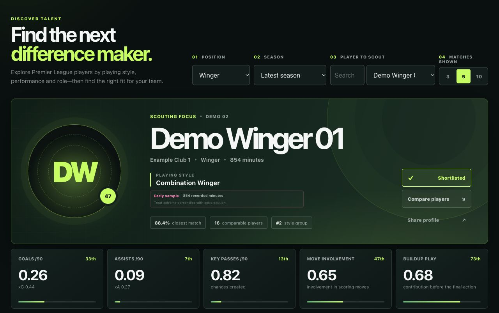
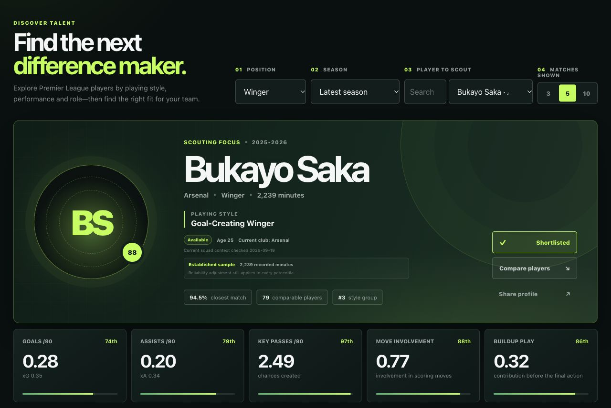
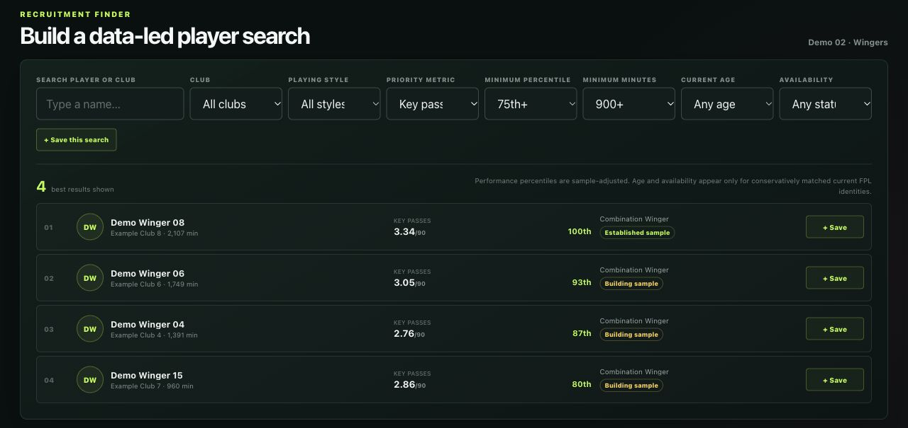
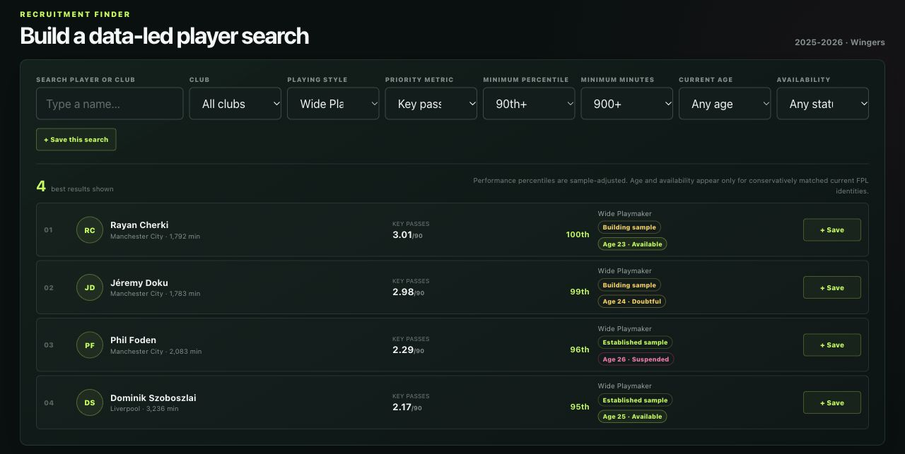
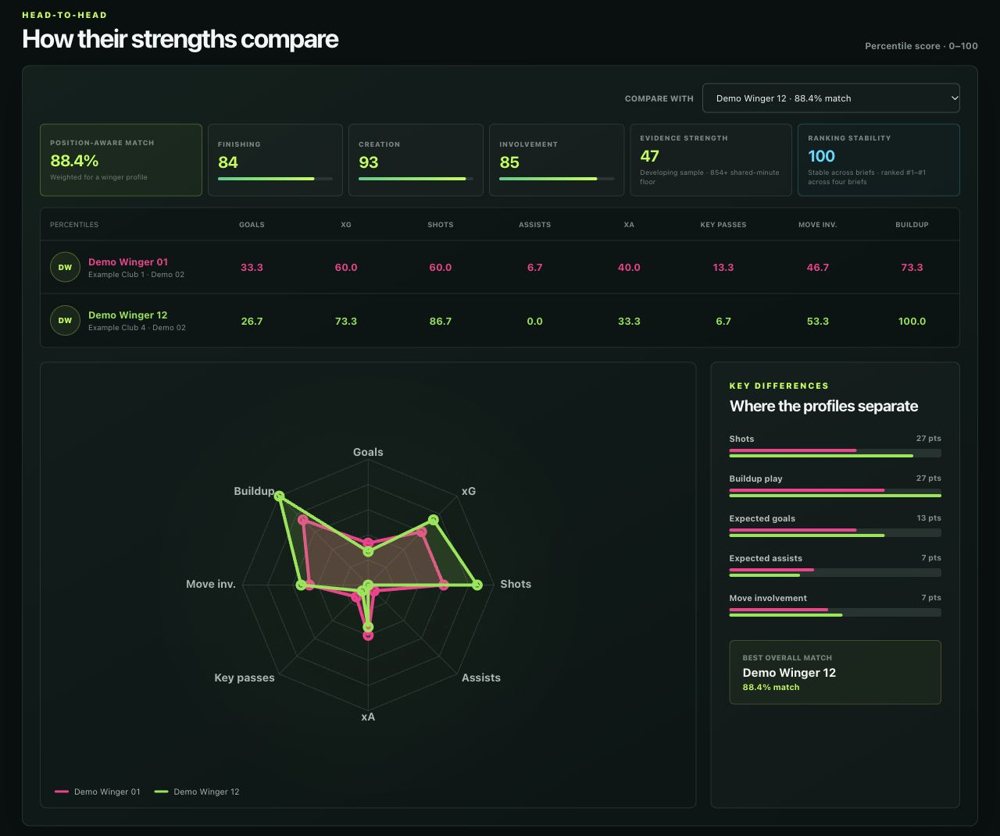
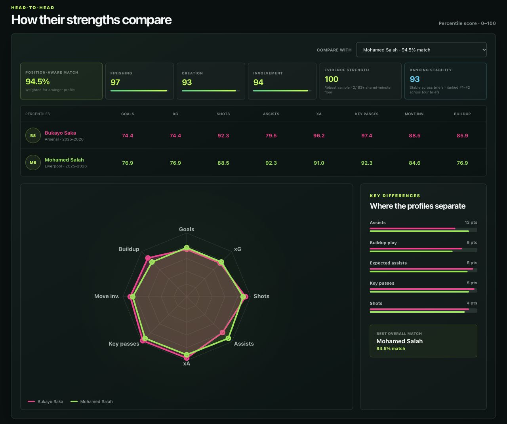
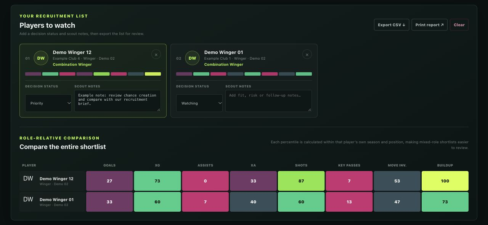
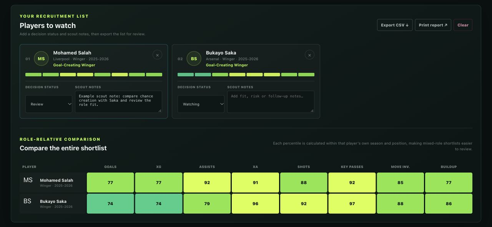

# Football Player Scouting Tool

SCOUT//LAB is an open-source scouting workspace for player comparisons, recruitment searches and shortlists. It retains the original interface, role-relative radars, similarity explanations and multi-season trends.

The public release starts with **128 fictional player-season profiles** across four positions and two demo seasons. These are original synthetic fixtures, not current Premier League statistics. Provider datasets, portraits and event files are not distributed with this release. You can import a compatible dataset you are permitted to use locally.

The real-player screenshots below show a separate local installation using the preserved **2025/26 Premier League snapshot**. A fresh clone opens with fictional demo profiles, not these real-player records or live 2026/27 coverage.

### Demo and real-player examples, side by side

<table width="100%">
  <tr><th width="50%">Included fictional demo</th><th width="50%">Local real-player example</th></tr>
  <tr>
    <td width="50%" valign="top"><a href="docs/screenshots/05-demo-profile-aligned.jpg"></a></td>
    <td width="50%" valign="top"><a href="docs/screenshots/05-real-profile-aligned.jpg"></a></td>
  </tr>
  <tr><td valign="top"><strong>Demo Winger 01</strong> — synthetic values; included with a fresh clone.</td><td valign="top"><strong>Bukayo Saka</strong> — historical 2025/26 values; requires a separate local import.</td></tr>
</table>

Each pair uses the same capture width and top-aligned layout. Images retain their natural proportions rather than being stretched or cropped to match heights. **Click any screenshot to open its complete full-size view.**

Both examples use the same scouting interface. The fictional profiles demonstrate the workflow; they are not estimates of real players. The real-player captures illustrate a historical local setup, not a live data service or evidence of publication permission.

## Data sources and coverage

| Source or mode | What it contributes | Coverage and limitations |
| --- | --- | --- |
| **Public demo** | 128 original fictional player-season profiles across four positions and two demo seasons. | Included in the repository. No real football observations or provider credentials required. |
| **Real-player screenshots** | Examples featuring Saka, Salah and other Premier League players from the preserved local snapshot. | Performance data is **2025/26**, not live 2026/27. Displayed squad context was last checked **19 September 2026**. Real datasets are not included. |
| [Understat](https://understat.com/) | Historical attacking statistics: goals, expected goals (xG), assists, expected assists (xA), shots, key passes, xGChain and xGBuildup. | Statistical source for the local real-player examples. Does not supply the defensive or full touch-location coverage needed for comprehensive scouting. Current-season access and publication permission remain unverified. |
| [Fantasy Premier League](https://fantasy.premierleague.com/) | Supporting player identity, club and availability context in the local prototype. | Supplemental, fantasy-oriented information—not a complete tactical dataset. Context can become stale; publication permission remains unconfirmed. |
| [API-Football](https://www.api-football.com/) | Optional historical enrichment experiments for defensive and other player statistics. | Not required for the demo and not the primary source for the screenshots. The existing free account rejected 2026/27 access on **4 October 2026**; historical pagination limits also produced partial coverage. |

**Calculated by the tool:** per-90 features, season/position-relative percentiles, reliability adjustments and weighted similarity results are derived from the available inputs. They are not provider-endorsed ratings. Imported playing-style labels are supplied with the dataset; importing does not train or validate a new model.

**Known gaps:** defensive coverage is limited, so attacking-profile similarity should not be treated as a complete assessment of defenders. Touch/action heatmaps require separate event-location observations; shot locations alone are not a touch heatmap. No verified free, permission-cleared live 2026/27 Premier League feed is bundled.

Source attribution describes provenance, not permission, partnership or endorsement. **Permission to publish the real-data screenshots remains unconfirmed**; keeping raw files out of GitHub does not resolve that question. See [the recorded permission and coverage review](docs/permissions/STATUS.md). The importer uses a file you supply and makes no provider downloads; see [the JSON schema and local setup](docs/LOCAL_DATA.md).

## Run on your device

Requirements: Git, Node.js 22 and npm. No provider account or API key is needed for demo mode.

```sh
git clone https://github.com/sagar-varshney/football-player-scouting-tool.git
cd football-player-scouting-tool/frontend
npm install
npm run dev -- --port 3011
```

Open http://localhost:3011. Search example players, adjust recruitment priorities, compare radars, save finder searches and build a shortlist with decision notes. Saved searches and shortlists live in your browser.

For a production build, run `npm run build` followed by `npm run start -- --port 3011`.

## Try the scouting workflow

These screenshots were captured from the local app with an imported dataset, using **Bukayo Saka and Mohamed Salah** as examples. Performance data shown covers **2025/26**; any displayed squad context was last checked **19 September 2026** and may be stale. Statistical source: [Understat](https://understat.com/). Supplemental squad context: [Fantasy Premier League](https://fantasy.premierleague.com/). Screenshots illustrate the interface; publication permissions for these sources remain unresolved, as recorded in [the source review](docs/permissions/STATUS.md).

You can follow the same workflow with fictional players immediately after installation. Real-player examples require your own compatible, permitted import; those datasets are not included in this repository.

### 1. Choose a player

Select **Winger** and **2025-2026**, then choose **Bukayo Saka** in the player selector if your imported dataset contains him. The profile shows his playing-style label, minutes and strongest metrics. Set **Matches shown** to 3, 5 or 10 to control the recommendation list. The workspace preview above shows these controls. In demo mode, use **Demo Winger 01** instead.

### 2. Find candidates for a recruitment brief

Open **Finder** in the navigation. Choose a priority metric such as **Key passes**, then set a minimum percentile and minutes threshold. Add club or playing-style filters to narrow the pool. Click a player's name to scout them, **+ Save** to shortlist them, or **+ Save this search** to revisit the filters later.

The fictional example uses **Key passes, 75th+ and 900+ minutes**. The real-player example adds **Wide Playmaker** and raises the threshold to **90th+**, showing Cherki, Doku, Foden and Szoboszlai. These are separate search examples, not equivalent player pools.

<table width="100%">
  <tr><th width="50%">Fictional recruitment search</th><th width="50%">Real-player recruitment search · 2025/26</th></tr>
  <tr>
    <td width="50%" valign="top"><a href="docs/screenshots/06-demo-finder-aligned.jpg"></a></td>
    <td width="50%" valign="top"><a href="docs/screenshots/06-real-finder-aligned.jpg"></a></td>
  </tr>
</table>

For another view of fit, use **Balanced role**, **Goal threat**, **Chance creator** or **Link player** above the finder. These priorities change similarity rankings; they do not change the underlying recorded or imported values.

### 3. Compare player profiles

Open **Compare**, then select a recommendation in **Compare with**. The screenshot compares **Bukayo Saka (pink)** with **Mohamed Salah (green)**. The radar and table show percentiles within the selected season and position; the difference bars highlight where the profiles diverge. Similarity describes a statistical match, not an overall player-quality score.

<table width="100%">
  <tr><th width="50%">Demo Winger 01 vs Demo Winger 12</th><th width="50%">Bukayo Saka vs Mohamed Salah · 2025/26</th></tr>
  <tr>
    <td width="50%" valign="top"><a href="docs/screenshots/07-demo-radar-aligned.jpg"></a></td>
    <td width="50%" valign="top"><a href="docs/screenshots/07-real-radar-aligned.jpg"></a></td>
  </tr>
</table>

### 4. Build a shortlist and record your decision

Save two players, then open **Shortlist**. This example saves **Saka and Salah**, sets Salah's status to **Review**, and adds an illustrative scout note. Set a decision status (**Watching**, **Review** or **Priority**) and add your own notes. With at least two players, a comparison matrix appears. Use **Export CSV** for a spreadsheet or **Print report** for a printable view. Saves and notes persist in the same browser; they are not synced between devices.

<table width="100%">
  <tr><th width="50%">Fictional shortlist and example notes</th><th width="50%">Salah and Saka shortlist · 2025/26</th></tr>
  <tr>
    <td width="50%" valign="top"><a href="docs/screenshots/08-demo-shortlist-aligned.jpg"></a></td>
    <td width="50%" valign="top"><a href="docs/screenshots/08-real-shortlist-aligned.jpg"></a></td>
  </tr>
</table>

These captures use initials rather than player photographs. Shot maps, portraits and action maps require suitable optional data assets. The demo leaves unavailable observations empty rather than inventing them. Follow the import instructions below to use a dataset you are permitted to use.

## Use your own dataset

```sh
cd frontend
npm run import-data -- /absolute/path/to/scouting-data.json
```

Copy `.env.example` to `.env.local`, set `SCOUTING_DATA_MODE=local`, and restart. Profiles live in ignored `.local-data/`; the importer does not download provider data. See [the schema and local setup](docs/LOCAL_DATA.md).

Only import material you are permitted to obtain, retain and use. Browser-visible data remains accessible. Hosting imported data requires applicable display/export permissions. Open-source code does not grant provider-data rights.

## Scouting workflows

- Position/season filters, searchable profiles and per-90 measures.
- Role-relative percentiles with a 900-minute reliability prior.
- Weighted similarity with finishing, creation and involvement explanations.
- Recruitment finder, saved searches, scatter plots and radar comparisons.
- Multi-season trends, shortlist notes/status, CSV exports and printable views.
- Dataset-mode/season labels and recoverable loading errors.
- Optional portrait, shot-map and historical event modules when suitable local assets are supplied.

Synthetic style groups are fixtures, not trained or validated football conclusions. The legacy Python pipeline is retained for separately authorized datasets; collectors are not a required installation step. Current touch heatmaps require current event coordinates. No verified free, cleared current-season PL provider is bundled. [Permission and coverage evidence](docs/permissions/STATUS.md).

## Development

```sh
cd frontend
npm test
npm run build
```

Python source and legacy tests are optional and require `requirements.txt` plus compatible local inputs. Dataset-dependent tests cannot run on a clean demo-only clone. CI checks the import boundary, absence of provider assets and frontend build without calling providers.

## Publication and licences

Original code, original documentation and synthetic fixtures are covered by [the MIT licence](LICENSE). Dependencies retain their own licences. This licence does not grant rights to third-party datasets, photographs, trademarks or any third-party content shown in screenshots. The included real-player screenshots are demonstrations, not a grant of provider-data rights or confirmation of publication permission.
