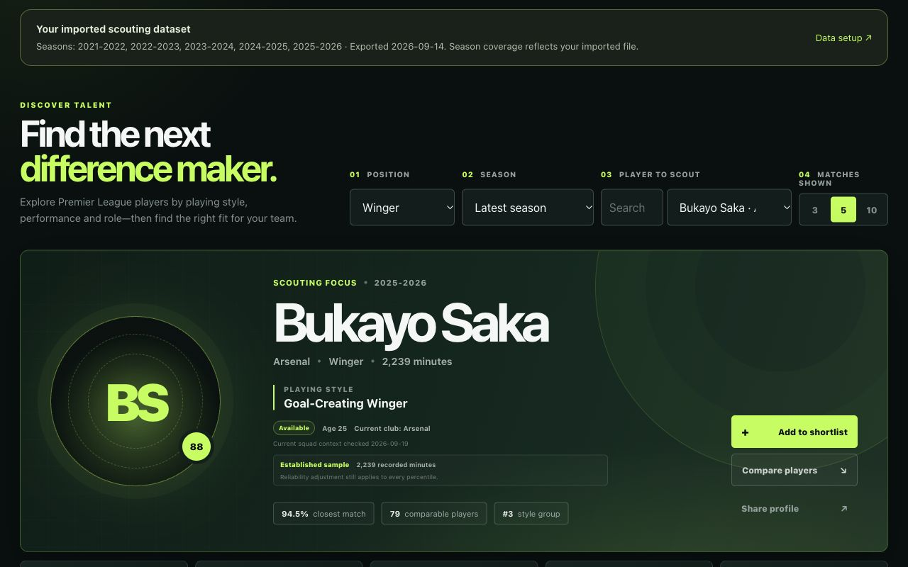
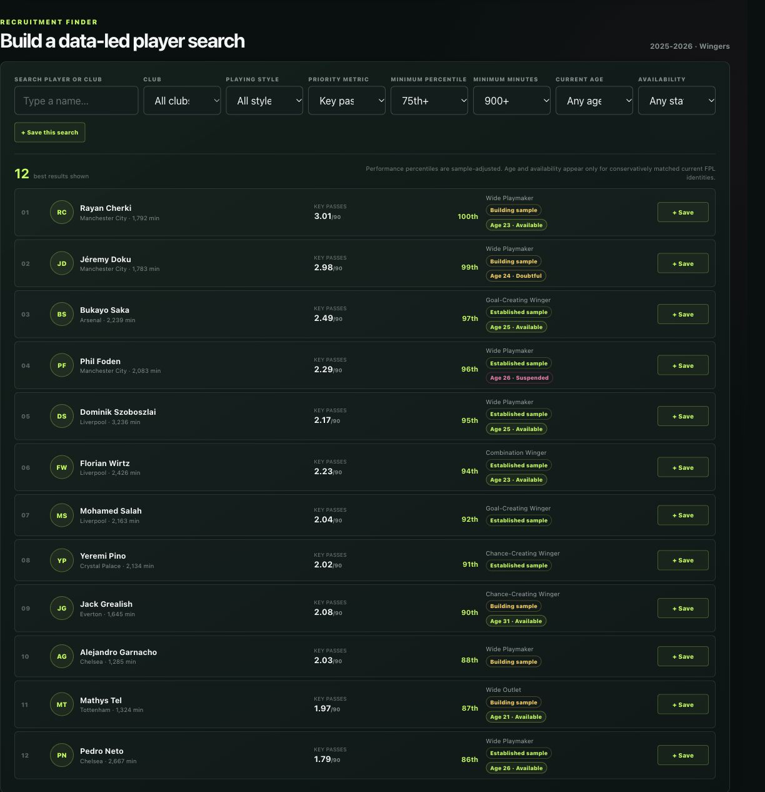
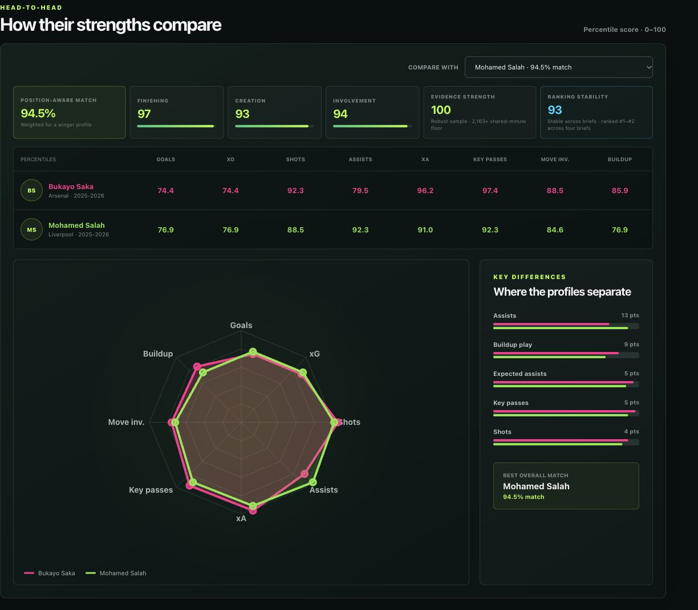
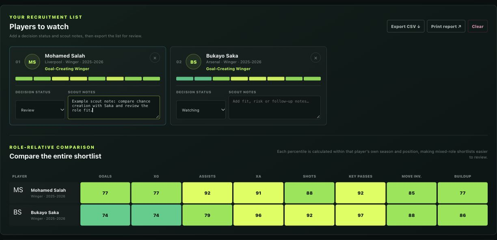

# Football Player Scouting Tool

SCOUT//LAB is an open-source scouting workspace for player comparisons, recruitment searches and shortlists. It retains the original interface, role-relative radars, similarity explanations and multi-season trends.

The public release starts with **128 fictional player-season profiles** across four positions and two demo seasons. These are original synthetic fixtures, not current Premier League statistics. Provider datasets, portraits and event files are not distributed with this release. You can import a compatible dataset you are permitted to use locally.

The screenshots below show a separate local installation using real-player data from the preserved **2025/26 snapshot**. A fresh clone opens with fictional demo profiles; the photographed screens are not the bundled demo dataset or live 2026/27 coverage.



## Run on your device

Requirements: Git, Node.js 22 and npm. No provider account or API key is needed for demo mode.

```sh
git clone https://github.com/sagar-varshney/football-player-scouting-tool.git
cd football-player-scouting-tool/frontend
npm install
npm run dev -- --port 3011
```

Open http://localhost:3011. Search example players, adjust recruitment priorities, compare radars, save finder searches and build a shortlist with decision notes. Saved searches and shortlists live in your browser.

For a production build, run `npm run build` followed by `npm run start -- --port 3011`.

## Try the scouting workflow

These screenshots were captured from the local app with an imported dataset, using **Bukayo Saka and Mohamed Salah** as examples. Performance data shown covers **2025/26**; any displayed squad context was last checked **19 September 2026** and may be stale. Statistical source: [Understat](https://understat.com/). Supplemental squad context: [Fantasy Premier League](https://fantasy.premierleague.com/). Screenshots illustrate the interface; publication permissions for these sources remain unresolved, as recorded in [the source review](docs/permissions/STATUS.md).

You can follow the same workflow with fictional players immediately after installation. Real-player examples require your own compatible, permitted import; those datasets are not included in this repository.

### 1. Choose a player

Select **Winger** and **2025-2026**, then choose **Bukayo Saka** in the player selector if your imported dataset contains him. The profile shows his playing-style label, minutes and strongest metrics. Set **Matches shown** to 3, 5 or 10 to control the recommendation list. The workspace preview above shows these controls. In demo mode, use **Demo Winger 01** instead.

### 2. Find candidates for a recruitment brief

Open **Finder** in the navigation. Choose a priority metric such as **Key passes**, then set a minimum percentile and minutes threshold. Add club or playing-style filters to narrow the pool. Click a player's name to scout them, **+ Save** to shortlist them, or **+ Save this search** to revisit the filters later.



For another view of fit, use **Balanced role**, **Goal threat**, **Chance creator** or **Link player** above the finder. These priorities change similarity rankings; they do not change the underlying recorded or imported values.

### 3. Compare player profiles

Open **Compare**, then select a recommendation in **Compare with**. The screenshot compares **Bukayo Saka (pink)** with **Mohamed Salah (green)**. The radar and table show percentiles within the selected season and position; the difference bars highlight where the profiles diverge. Similarity describes a statistical match, not an overall player-quality score.



### 4. Build a shortlist and record your decision

Save two players, then open **Shortlist**. This example saves **Saka and Salah**, sets Salah's status to **Review**, and adds an illustrative scout note. Set a decision status (**Watching**, **Review** or **Priority**) and add your own notes. With at least two players, a comparison matrix appears. Use **Export CSV** for a spreadsheet or **Print report** for a printable view. Saves and notes persist in the same browser; they are not synced between devices.



These captures use initials rather than player photographs. Shot maps, portraits and action maps require suitable optional data assets. The demo leaves unavailable observations empty rather than inventing them. Follow the import instructions below to use a dataset you are permitted to use.

## Use your own dataset

```sh
cd frontend
npm run import-data -- /absolute/path/to/scouting-data.json
```

Copy `.env.example` to `.env.local`, set `SCOUTING_DATA_MODE=local`, and restart. Profiles live in ignored `.local-data/`; the importer does not download provider data. See [the schema and local setup](docs/LOCAL_DATA.md).

Only import material you are permitted to obtain, retain and use. Browser-visible data remains accessible. Hosting imported data requires applicable display/export permissions. Open-source code does not grant provider-data rights.

## Scouting workflows

- Position/season filters, searchable profiles and per-90 measures.
- Role-relative percentiles with a 900-minute reliability prior.
- Weighted similarity with finishing, creation and involvement explanations.
- Recruitment finder, saved searches, scatter plots and radar comparisons.
- Multi-season trends, shortlist notes/status, CSV exports and printable views.
- Dataset-mode/season labels and recoverable loading errors.
- Optional portrait, shot-map and historical event modules when suitable local assets are supplied.

Synthetic style groups are fixtures, not trained or validated football conclusions. The legacy Python pipeline is retained for separately authorized datasets; collectors are not a required installation step. Current touch heatmaps require current event coordinates. No verified free, cleared current-season PL provider is bundled. [Permission and coverage evidence](docs/permissions/STATUS.md).

## Development

```sh
cd frontend
npm test
npm run build
```

Python source and legacy tests are optional and require `requirements.txt` plus compatible local inputs. Dataset-dependent tests cannot run on a clean demo-only clone. CI checks the import boundary, absence of provider assets and frontend build without calling providers.

## Publication and licences

Original code and synthetic fixtures are covered by the MIT licence. Dependencies retain their own licences. Provider data and visual assets are excluded. Keep secrets and imported files out of commits. Review [source status](DATA_SOURCES.md) before enabling collectors or hosting imported data. Ignoring files does not remove older copies in Git history.
